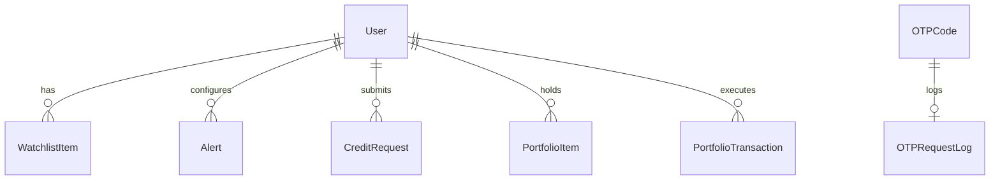

# 📈 StockVision Pro: System Architecture & Technical Specifications

This document provides a comprehensive technical breakdown of **StockVision Pro**, mapping every folder, file, database schema, API endpoint, and feature.

---

## 📁 Directory & File Structure Map

```text
stock-vision-pro/
├── docker-compose.yml       # Docker orchestration setup for services
├── test_stockvision.db      # Test database for integration tests
├── backend/                 # FastAPI async Python backend
│   ├── .dockerignore        # Docker build ignore file
│   ├── .env                 # Environment secrets (JWT_SECRET, admin credentials, SMTP)
│   ├── .env.example         # Template environment variables
│   ├── Dockerfile           # Backend container build configuration
│   ├── main.py              # Application entrypoint & background alert loop
│   ├── requirements.txt     # Python backend dependencies
│   ├── test_integration.py  # Integration test suite
│   ├── models/              # Database models and data schemas
│   │   ├── __init__.py      # Package initialization
│   │   ├── database.py      # SQLAlchemy models & migrations engine
│   │   └── schemas.py       # Pydantic schemas for request/response validation
│   ├── routers/             # API Router endpoints
│   │   ├── __init__.py      # Package initialization
│   │   ├── admin.py         # Admin login, OTP verification, and credit requests
│   │   ├── ai.py            # AI assistant/chatbot and screener routes
│   │   ├── alerts.py        # Price and indicator alert rules CRUD
│   │   ├── auth.py          # User authentication and registration via OTP
│   │   ├── backtest.py      # Historical strategy backtester
│   │   ├── compare.py       # Stock comparison analysis and statistics
│   │   ├── market.py        # Global market overview and general screener
│   │   ├── portfolio.py     # Paper trading orders and credit requests
│   │   ├── stock.py         # Real-time quotes, technical indicators, and forecasts
│   │   └── watchlist.py     # User-specific watchlist management
│   └── services/            # Business logic and external service integrations
│       ├── __init__.py      # Package initialization
│       ├── analysis_service.py # Core calculations: RF forecasting, signals, VADER sentiment, chatbot, comparisons
│       ├── data_service.py  # Yahoo Finance API fetching, caching, and symbol search
│       ├── mail_service.py  # SMTP email client for dispatching OTPs and notifications
│       ├── mongodb_service.py # MongoDB fallback service integration
│       ├── stock_universe.py# Local ticker definitions and helper methods
│       └── technical_service.py # Technical indicators (RSI, MACD, Bollinger Bands, SMA, EMA, ATR, Stochastic)
└── frontend/                # Vite + React SPA frontend
    ├── .dockerignore        # Docker build ignore file
    ├── Dockerfile           # Frontend container build configuration
    ├── index.html           # Main SPA entry HTML template
    ├── nginx.conf           # Production Nginx server configuration
    ├── package.json         # Node.js dependencies and run scripts
    ├── tsconfig.json        # TypeScript configuration
    ├── vite.config.ts       # Vite build configurations
    └── src/                 # Application codebase
        ├── main.tsx         # App routing, AppShell, pages, and components
        ├── api/             
        │   └── client.ts    # Axios HTTP client, API functions, and type definitions
        └── styles/          
            └── globals.css  # Global design system, layout styles, and CSS variables
```

---

## 🗄️ Database Schema & Models (`backend/models/database.py`)

StockVision Pro utilizes **SQLite** (configured via `sqlalchemy`) with self-healing, automatic database migrations during startup. The tables and schemas are described below:



### 1. `users` Table
Stores authenticated user records.
- `id` (String(128), Primary Key): Unique identifier (e.g. `usr_...`).
- `email` (String(255), Unique, Indexed): User email address.
- `hashed_password` (String(255), Nullable): Password hash (if password auth is set).
- `role` (String(32), Default: `"user"`): Role identifier (guarding standard user features).
- `created_at` (DateTime, Timezone=True): Record creation time.
- `updated_at` (DateTime, Timezone=True): Auto-updated record modification time.

### 2. `watchlist_items` Table
Stores tickers watched by users. Includes a unique constraint on `(user_id, symbol)`.
- `id` (Integer, Primary Key, Indexed): Unique ID.
- `user_id` (String(128), Indexed): Reference to user.
- `symbol` (String(32), Indexed): Stock symbol (e.g., `AAPL`, `RELIANCE.NS`).
- `name` (String(255), Nullable): Company or instrument name.
- `position` (Integer, Default: `0`): Custom sorting sequence.
- `created_at` (DateTime): Date added.

### 3. `alerts` Table
Stores price and indicator thresholds set by users for browser push notifications.
- `id` (Integer, Primary Key, Indexed): Unique ID.
- `user_id` (String(128), Indexed): Reference to user.
- `symbol` (String(32), Indexed): Target ticker symbol.
- `alert_type` (String(32)): Type of alert (e.g., `"price_above"`, `"price_below"`, `"rsi_above"`, `"rsi_below"`).
- `value` (Float): Trigger value threshold.
- `is_active` (Boolean, Default: `True`): Active state indicator.
- `triggered_at` (DateTime, Nullable): Timestamp when the alert was triggered.
- `created_at` (DateTime): Date created.

### 4. `credit_requests` Table
Tracks user requests for mock simulation paper trading credits.
- `id` (Integer, Primary Key, Indexed): Auto-incremented ID.
- `user_id` (String(128), Indexed): Submitting user ID.
- `amount` (Float): Number of simulation credits requested.
- `reason` (String(255), Nullable): Reasoning given by the user.
- `status` (String(32), Default: `"pending"`): Status of the request (`"pending"`, `"approved"`, `"rejected"`).
- `admin_note` (String(255), Nullable): Note added by the administrator upon approval/rejection.
- `approved_at` (DateTime, Nullable): Time approved/rejected.
- `approved_by` (String(255), Nullable): Email of the administrator who resolved the request.
- `created_at` (DateTime): Submission time.
- `updated_at` (DateTime): Auto-updated modification time.

### 5. `portfolio_items` Table
Maintains user holdings for paper trading. Includes a unique constraint on `(user_id, symbol)`.
- `id` (Integer, Primary Key): Unique ID.
- `user_id` (String(128), Indexed): Reference to user.
- `symbol` (String(32), Indexed): Asset symbol.
- `shares` (Float, Default: `0.0`): Total amount of shares owned.
- `average_price` (Float, Default: `0.0`): Average buy-in price.
- `created_at` / `updated_at` (DateTime): Metadata timestamps.

### 6. `portfolio_transactions` Table
Logs individual buy and sell orders.
- `id` (Integer, Primary Key): Transaction index.
- `user_id` (String(128), Indexed): User ID executing the trade.
- `symbol` (String(32), Indexed): Traded asset symbol.
- `action` (String(10)): Transaction direction (`"buy"` or `"sell"`).
- `shares` (Float): Quantity of shares traded.
- `price` (Float): Trade price per share.
- `timestamp` (DateTime): Transaction execution timestamp.

### 7. `otp_codes` Table
Temporary database cache containing generated verification OTPs.
- `id` (Integer, Primary Key): Auto-incremented ID.
- `email` (String(255), Indexed): Destination email.
- `code` (String(6)): Generated 6-digit numeric string.
- `expires_at` (DateTime): Validity deadline.
- `attempts` (Integer, Default: `0`): Tracked attempts (prevents brute-force).
- `pending_password` (String(255), Nullable): Target password during register/reset.
- `pending_role` (String(32), Default: `"user"`): Role to inherit upon verification.
- `created_at` (DateTime): Creation timestamp.

### 8. `otp_request_logs` Table
Maintains a log of OTP dispatch times to rate limit requests.
- `id` (Integer, Primary Key): Log ID.
- `email` (String(255)): Associated email address.
- `requested_at` (DateTime): Dispatch timestamp.

### 9. `cache_entries` Table
Key-value text cache storing response data (e.g. news, financial reports) from APIs like Yahoo Finance.
- `key` (String(255), Primary Key): Query hashing identifier.
- `payload` (Text): Cached response JSON.
- `expires_at` (DateTime, Indexed): Validity limit.
- `created_at` (DateTime): Cached date.

---

## 🛠️ Core Capabilities & Backend Services

### 📊 Technical Services (`backend/services/technical_service.py`)
Computes indicators on pandas DataFrames using the `ta` library:
* **RSI (Relative Strength Index)**: Overbought (>70) and oversold (<30) momentum gauge.
* **MACD (Moving Average Convergence Divergence)**: Computes macd line, signal line, and histogram value.
* **Bollinger Bands**: Generates upper, middle (SMA), and lower bands, alongside band width.
* **Simple Moving Averages (SMA)**: Computes 20, 50, and 200 period moving averages.
* **Exponential Moving Averages (EMA)**: Computes 12 and 26 period moving averages.
* **ATR (Average True Range)**: Measure of asset volatility over 14 intervals.
* **Stochastic Oscillator**: Computes %K and %D lines for momentum evaluation.

### 🔮 Machine Learning & Analysis (`backend/services/analysis_service.py`)
* **Random Forest Regressor Forecasting**: Enriches data using indicators and dates, fitting a `RandomForestRegressor` with 80 estimators to generate a 30-day price target (base, bull, and bear scenarios) and a model confidence percentage.
* **Technical Trading Signals**: Calculates indicator scores (e.g., RSI crossovers, SMA trend alignment, volume surges) to emit a `BUY`, `SELL`, or `HOLD` verdict with a strength rating of 1 to 5.
* **Financial News Sentiment**: Fetches headlines from Yahoo Finance API, analyzing them via `vaderSentiment` to yield a compound polarity score and aggregate sentiment splits.
* **Economic Calendar**: Defines upcoming macroeconomic events (Feds, RBI, non-farm payroll, CPI) with dates and categories.

### 📧 SMTP Mailer Service (`backend/services/mail_service.py`)
Dispatches emails through SMTP (supports Gmail App Password or custom servers):
* Sends security login OTPs.
* Dispatches email notifications when a user's credit request is approved or rejected by an admin.
* Dispatches price and technical indicator alert triggers.

---

## 🔌 API Endpoint Specifications

All endpoints are prefixed with `/api`.

### 🔐 User Auth Routers (`routers/auth.py`)
* `POST /auth/send-otp`: Generates a rate-limited OTP and sends it via email (supports `signin`, `signup`, `reset_password`).
* `POST /auth/verify-otp`: Validates the OTP code, registers the user, and signs them in by returning a JSON Web Token (JWT).
* `POST /auth/signin`: Standard email/password verification returning a JWT.

### 🛡️ Admin Routers (`routers/admin.py`)
* `POST /admin/signin`: Verifies admin email/password against environment variables `ADMIN_EMAIL` and `ADMIN_PASSWORD` (independent of the user database table) and sends an OTP to `ADMIN_EMAIL`.
* `POST /admin/verify-otp`: Validates OTP and returns a secure token (`svp_admin_token`) with the admin role.
* `GET /admin/requests`: Lists all pending, approved, and rejected user credit requests.
* `POST /admin/approve/{id}`: Approves a user's simulation credit request, updates their portfolio balance, stores `approved_at` and `approved_by` metadata, and emails the user.
* `POST /admin/reject/{id}`: Rejects the request, registers an admin note, stores `approved_at` and `approved_by` metadata, and emails the user.

### 💼 Portfolio Routers (`routers/portfolio.py`)
* `GET /portfolio/requests`: Retrieves the logged-in user's credit request history.
* `POST /portfolio/request-credits`: Submits a new request for mock credits (limits pending requests to one at a time).
* `GET /portfolio/{user_id}`: Retrieves the portfolio balance, net worth, holdings list, and profit/loss.
* `POST /portfolio/trade`: Processes a simulated market buy/sell order.
* `GET /portfolio/{user_id}/transactions`: Retrieves the user's historical simulated transaction logs.

### 🔔 Alert Routers (`routers/alerts.py`)
* `GET /alerts/{user_id}`: Lists all active/triggered alerts for a user.
* `POST /alerts/add`: Adds a new alert rule (price above/below, RSI above/below).
* `DELETE /alerts/{user_id}/{symbol}`: Removes alert configurations.

### 🚀 Backtesting Routers (`routers/backtest.py`)
* `POST /backtest/run`: Performs historical simulations on a ticker using strategies like **SMA Crossover** or **RSI Crossover** over a 2-year window, computing total returns, win rates, drawdowns, and Sharpe ratios.

---

## 🎨 Frontend & Design System (`frontend/src`)

### 📦 Structure
* **`main.tsx`**: Single-page entry file containing all routing rules (`AppShell`), view containers, and subcomponents:
  * `Dashboard`: Main market charts, quotes search, and indicators.
  * `Lab`: Multi-asset normalized comparisons and correlation matrices.
  * `Portfolio`: Mock trading desk, transaction logs, credit balance, and credit request form.
  * `AdminLoginPortal` & `AdminDashboard`: Secure login overlays and admin-only desks.
  * Reusable items: `TickerBar`, `IndexCard`, `Watchlist`, `NewsCard`, `ChatAssistant`, `EconomicCalendar`, etc.

### 🎨 CSS Variables & Dark Mode (`styles/globals.css`)
Custom variables defined at the `:root` level for theme toggling:
- `--bg-base`: Core canvas background (`#0b0f19` in dark mode).
- `--bg-surface`: Card/container background (`#131a2c` in dark).
- `--border`: Borders and separators (`rgba(255, 255, 255, 0.08)`).
- `--text-primary`: Bold titles (`#f8fafc`).
- `--text-secondary`: Supporting labels (`#94a3b8`).
- `--primary`: Accent color (`#3b82f6`).
- `--success` / `--danger`: Green (`#10b981`) and red (`#ef4444`) indicators.
- `.glass-card`: Semi-transparent background using `backdrop-filter: blur(12px)`.

---

## 🛠️ Verification & Run Commands

### Start Services Locally

**Backend (Port 8000)**:
```powershell
# In /backend directory
.\venv\Scripts\activate
python -m uvicorn main:app --host 127.0.0.1 --port 8000
```

**Frontend (Port 5173)**:
```powershell
# In /frontend directory
npm run dev
```

### Integration Tests
Run pytest integration tests verifying auth separation, API route guards, and credit requests flow:
```powershell
# In /backend directory
.\venv\Scripts\activate
pytest test_integration.py -v
```
